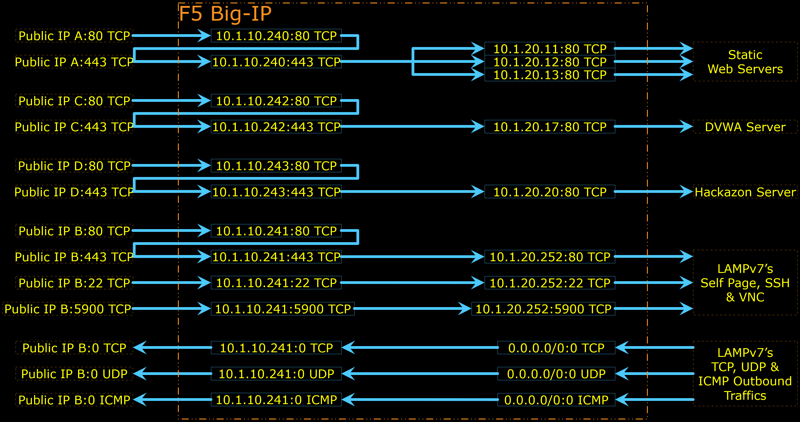
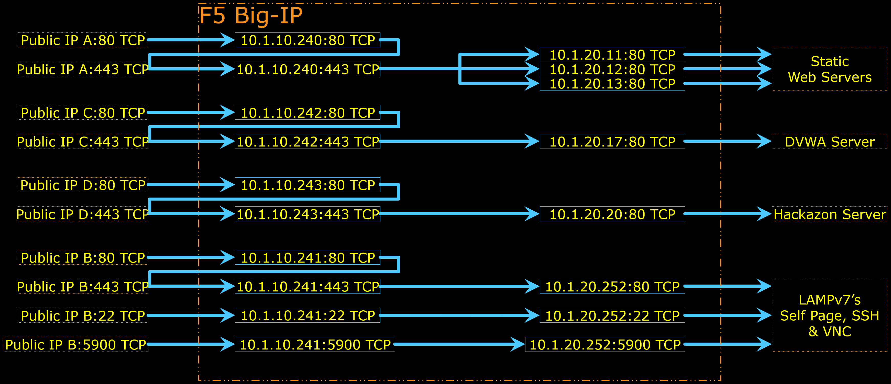

# AS3 Configuration Samples

This folder contains only **samples** of how Big-IP can be configured using a JSON declaration via REST API. Refer to [Application Services 3 Extension Documentation](https://clouddocs.f5.com/products/extensions/f5-appsvcs-extension/latest/) for further details on how to build AS3 Declaration.


***

## AS3 for LTM with HTTP redirected to HTTPS, and SSL-OffLoad

The diagram below depicts the Logical Configuration Diagram built by [AS3_LTM_SSLOffLoad.json](AS3_LTM_SSLOffLoad.json) AS3 Declaration.


- [ ] HTTP Virtual Servers are redirected to HTTPS Virtual Server.
- [ ] HTTPS Virtual Servers are using SSL-OffLoad. Traffic to server is plain-text.
- [ ] Listener/Virtual Server on Port 22 and 5900 for SSH and VNC to the LAMPv7 Server
- [ ] Note that there are Virtual Servers which allow the Nodes/Servers to reach out to Internet (example: to do software updates).

AS3 Declaration configures only the stuffs inside Big-IP (refer to the diagram above).
Anything outside Big-IP shall be configured by AWS CloudFormation ; or if you use this AS3 Declaration in VE or Hardware; the things outside Big-IP shall be configured separately, either manually or by other scripts or some external orchestrator node.


***

## AS3 for LTM with SSL-OffLoad and HTTP/TCP Analytics Profile (No OutBound)

The diagram below depicts the Logical Configuration Diagram built by [AS3_LTM_SSLoL_AVR_NOutB.json](AS3_LTM_SSLoL_AVR_NOutB.json) AS3 Declaration.


- [ ] HTTP Virtual Servers are redirected to HTTPS Virtual Server.
- [ ] HTTPS Virtual Servers are using SSL-OffLoad. Traffic to server is plain-text.
- [ ] HTTP and HTTPS Virtual Servers are attached with both HTTP and TCP Analytics Profiles.
- [ ] TCP Virtual Servers are attached with TCP Analytics Profile.
- [ ] Listener/Virtual Server on Port 22 and 5900 for SSH and VNC to the LAMPv7 Server

AS3 Declaration configures only the stuffs inside Big-IP (refer to the diagram above).
Anything outside Big-IP shall be configured by AWS CloudFormation ; or if you use this AS3 Declaration in VE or Hardware; the things outside Big-IP shall be configured separately, either manually or by other scripts or some external orchestrator node.


***

<br><br><br>
```
╔═╦═════════════════╦═╗
╠═╬═════════════════╬═╣
║ ║ End of Document ║ ║
╠═╬═════════════════╬═╣
╚═╩═════════════════╩═╝
```
<br><br><br>


