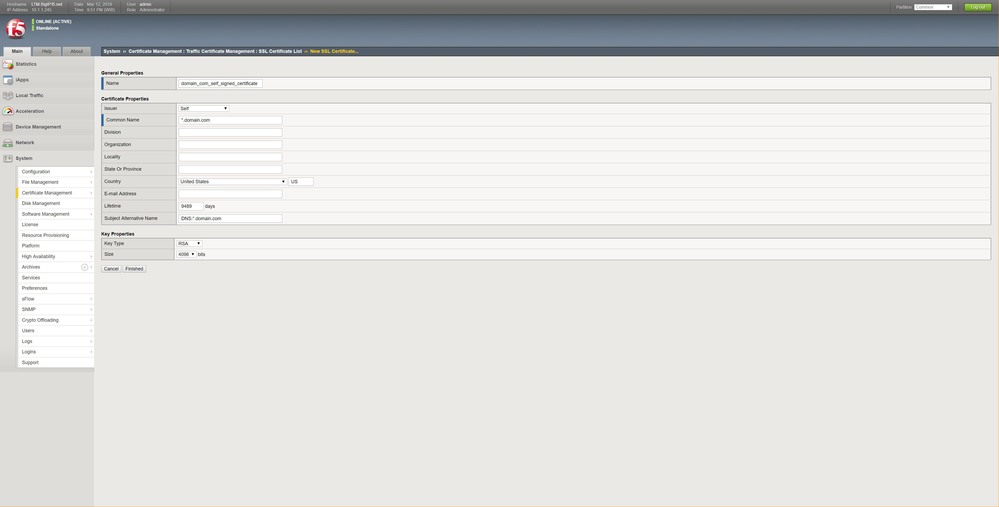
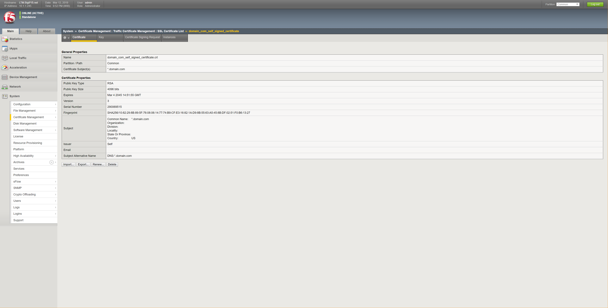
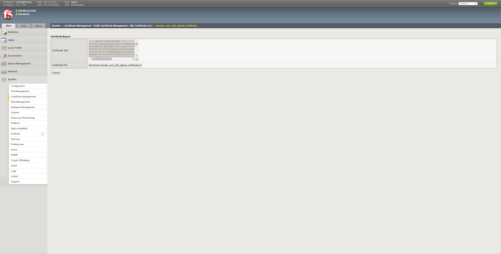
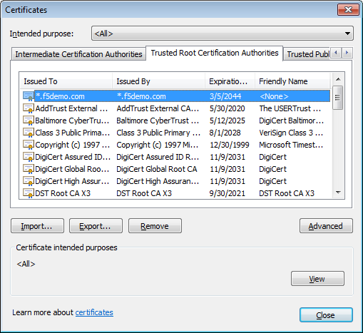
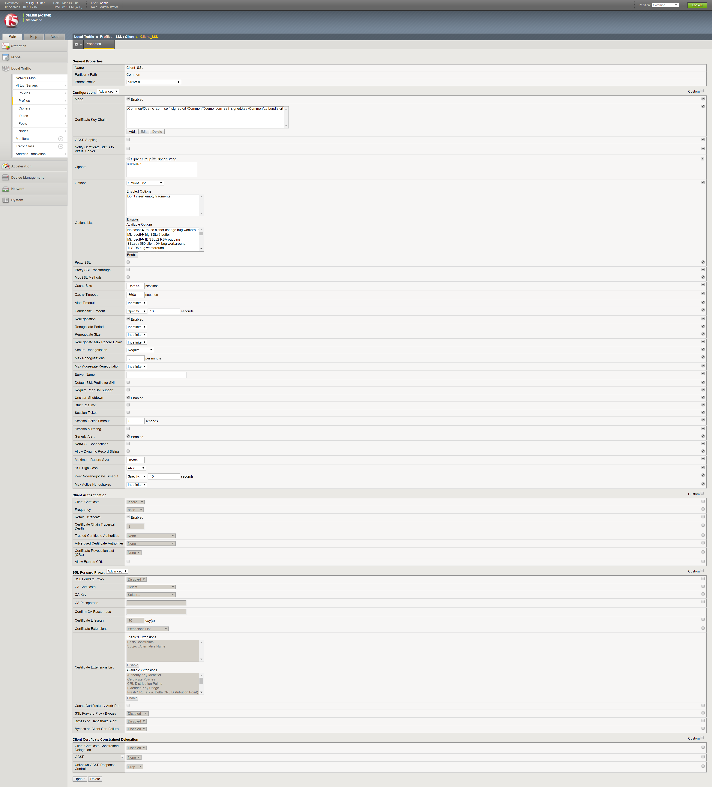
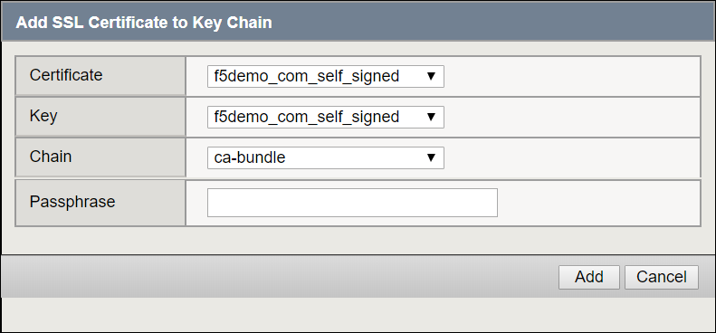

# How to create Self Signed SSL Certificate with F5 Big-IP, and import the Self Signed SSL Certificate into Browser

Some of the images in the notes are high resolution images. Just click the image to show the image in separate tab, or right-click the image and select "Open image in new tab" to have better view of the image.



Important fields are filled as above, with example of wild-card domain name and the longest possible Lifetime value:
- [ ] Fill in the “Name” field with the intended/targeted certificate name (or file name when it is exported).
- [ ] “Common Name” usually filled with the domain name for which the certificate is made for. Wild-card can be used. Example `*.domain.com` .
- [ ] The largest possible “Lifetime” value is 9489 .
- [ ] Fill in “Subject Alternative Name” with domain name, following the pattern `DNS:*.domain.com` or `DNS:www.example.com, DNS:www.exchange.example.com, DNS:www.example.internal.net, IP:203.0.113.100` . Further reference can be viewed at [Creating SSL SAN certificates and CSRs using the Configuration utility or tmsh](https://support.f5.com/csp/article/K13471) .

Below is a sample result, which can be exported, and in turn can be imported into Browser.



To export the Self Signed SSL Certificate, click the “Export...” button.



Then click the “Download [Self Signed SSL Certificate Name].crt” button, and safe the Self Signed SSL Certificate file.

To import into Windows based Browser; import the certificate into “Trusted Root Certification Authorities” store/category.



Import can be done by importing the Self Signed SSL Certificate through Internet Explorer Browser. Sample steps described below:

Menu “Tools”, Sub Menu “Internet Options”, Tab “Content”, Button “Certificates”, Tab “Trusted Root Certification Authorities”, Button “Import...”, Button “Next >”, Fill in the Path and File Name or Click “Browse...” Button and select the Self Signed SSL Certificate file to be imported, Re-Ensure the Self Signed SSL Certificate will be imported into the “Trusted Root Certification Authorities”, Click “Next >” Button, Click “Finish” Button, and confirm when the system try to reconfirm the import.

Alternatively, import can be done by Right-Click the Certificate file in the Windows Explorer, and select the Sub Menu “Install Certificate”, Click “Next >” Button, Ensure the Certificate will be imported into “Trusted Root Certification Authorities” by selecting Radio Button “Place all certificates in the following store” and Click “Browse...” Button, and choose “Trusted Root Certification Authorities” from the available stores/categories and click “OK” Button, Ensure the selection is OK before clicking “Next >” Button, Click “Finish” Button, and confirm when the system try to reconfirm the import.

Microsoft Windows’ Internet Explorer Browser and Google’s Chrome Browser should work fine without warning. Mozilla’s Firefox Browser won’t work fine with the Self Signed SSL Certificates.

Create Client SSL Profile:



Important field is the “Certificate Key Chain”. Click “Add” then Dialog Box as below appear:



In “Certificate” and “Key” fields, choose the Self Signed SSL Certificate; while on the “Chain” field choose the “ca-bundle” from F5. “Passphrase” field is optional. Click “Add” to finish.

Use the built Client SSL Profile on the Virtual Server which will handle traffic from the Client on which the same Self Signed SSL Certificate is imported.


***

Reference [Creating SSL certificates and keys with OpenSSL](https://support.f5.com/csp/article/K14534) describes an alternative way to create the SSL Certificate and Private Key.

<br><br><br>
```
╔═╦═════════════════╦═╗
╠═╬═════════════════╬═╣
║ ║ End of Document ║ ║
╠═╬═════════════════╬═╣
╚═╩═════════════════╩═╝
```
<br><br><br>


