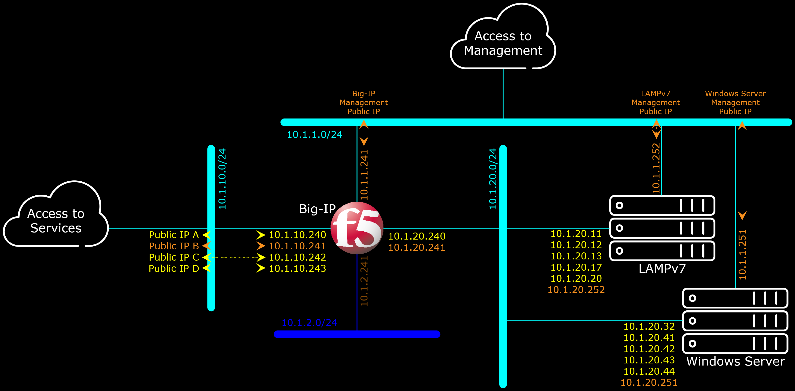

# Big-IP Lab Environment


The target goal of this repository is to automate the creation of F5 Lab environment (as found in vLab section under [F5 Networks' Download Site](https://downloads.f5.com/)) in AWS using CloudFormation template.

The diagram below depicts the Logical Network Diagram built by the CloudFormation templates in this repository.


At the moment, the default values in this CloudFormation templates were designed to work in only in AWS Region Tokyo, Seoul and Singapore (`ap-northeast-1`, `ap-northeast-2` and `ap-southeast-1`).
The reason of that is because the adapted LAMPv7 and Windows Server 2008 R2 VMs are only imported to AWS Region Tokyo, Seoul and Singapore; so the adapted LAMPv7 and Windows Server 2008 R2 AMIs exist only in those AWS Regions.
To make the template works in any other AWS Regions, the adapted LAMPv7 and Windows Server 2008 R2 AMIs must exist in the targeted region and be accessible by the targeted account, before the execution of the template.
Which can be achieved by re-importing the adapted LAMPv7 and Windows Server 2008 R2 VMs, or by copying the adapted LAMPv7 and Windows Server 2008 R2 AMIs in Tokyo, Seoul or Singapore to the targeted other AWS Region.
Once the adapted LAMPv7 and Windows Server 2008 R2 AMIs exist in the targeted AWS Region, the AMI ID of the adapted LAMPv7 and Windows Server 2008 R2 need to be indicated properly (i.e. not using the default value) during execution of the template.
Refer to [LAMPv7](LAMPv7\/) and [WindowsServer2008R2](WindowsServer2008R2\/) for sample procedure(s) to adapt the servers to AWS Environment.

The Big-IP AMI should be available in most (if not ALL) of AWS Regions as part of F5 Networks effort to commercialized usage of the product in AWS.
Only the correct AMI ID of Big-IP within the targeted AWS Region is needed, which should not be difficult to find.
This template already has default values for Big-IP AMI ID in most AWS Regions.
You will also need a valid F5 Big-IP License to execute the template and having a running Big-IP Instance.

Note that the CloudFormation templates were tested with Big-IP version 15.1.2.1 build 0.0.10.

This CloudFormation template is designed for building Demo/Testing environment only.
It was NOT designed to be used for Live/Commercial environment !!!
This CloudFormation Template is developed by individual and is NOT supported by F5 Networks.

Read through the input parameters descriptions below to understand what the CloudFormation template creates and does.
Some further references are provided on the description of each parameter field.

Some of the folders contain further details, specific to the part/subject which the folder covers.
For example: samples in AS3 and TMSH folders can actually be used outside CloudFormation template, like in F5 Big-IP Hardware or Big-IP Virtual Machine implementation (that is with assumption that the network addressing are identical).


***

## Template Parameters

<a href="https://console.aws.amazon.com/cloudformation/home?region=ap-southeast-1#/stacks/new?stackName=BigIP-Lab&templateURL=https://aws-f5-singapore-hc-demo-bucket-files.s3-ap-southeast-1.amazonaws.com/CF/CF_BigIP_Lab_AS3.25_TMSH_UpGrade_Region_Original.json"></a>
<br>

After clicking the "Launch Stack" button above, you need to specify input parameters to the CloudFormation stack (better to do right click and open link in new tab, so you can refer back to the below table).

| CFT Label | Parameter Name | Required | Description |
| --- | --- | --- | --- |
| Stack Name | Stack Name | Mandatory and Unique Across Account | Give a unique name to the CloudFormation stack. Stack name will be used to prefix all resources created by this CloudFormation template. Stack name can include letters (A-Z and a-z), numbers (0-9), and dashes (-). |
| PreFix for Name Tags | TagPreFix | Optional | Give a Prefix to be used for Prefix-Naming all resources created by this CloudFormation template. In an account where there are multiple users, using initial will help to identify who owns the resources which this CloudFormation template creates. |
| Big-IP Image ID | BigIPImageID | Mandatory with Default Value | Default value uses "AllTwoBootLocations" versions of Big-IP AMI ID excerpt from [F5 Networks' AWS CloudFormation GitHub Repository](https://github.com/F5Networks/f5-aws-cloudformation/blob/master/supported/standalone/n-nic/existing-stack/byol/f5-existing-stack-byol-n-nic-bigip.template) reference. Unless a custom Big-IP AMI ID is required, generally use "Default" value should be OK. |
| Big-IP Instance Type | BigIPInstanceType | Mandatory with Default Value | Select an EC2 Instance Type for the Big-IP instance. Note that instance type also influence the number of network interfaces and IP addresses which can be assigned into the instance. Refer to section [IP Addresses per Network Interface per Instance Type](https://docs.aws.amazon.com/AWSEC2/latest/UserGuide/using-eni.html) for more details. Selecting too small instance type may hinder the CloudFormation to work as expected. |
| LAMP Server Image ID | LAMPServerImageID | Mandatory | Input AMI ID for LAMPv7 Server which has been adapted to AWS environment. "Default" value is applicable only on AWS Region Tokyo, Seoul and Singapore. Note that the LAMPv7 from [F5 Networks' Download Site](https://downloads.f5.com/) requires a "32-bit (x86)" architecture/machine, which AWS is phasing this architecture out. For example, at the time of this document writing, AWS Region Hong Kong has no longer support any "32-bit (x86)" architecture/machine. And therefore this CloudFormation template can not be executed in AWS Region Hong Kong. Refer to [LAMPv7](LAMPv7\/) for sample procedure to adapt the LAMPv7 Server to AWS Environment. |
| LAMP Server Instance Type | LAMPServerInstanceType | Mandatory with Default Value | Select an EC2 Instance Type for the LAMP Server instance. Note that instance type also influence the number of network interfaces and IP addresses which can be assigned into the instance. Refer to section [IP Addresses per Network Interface per Instance Type](https://docs.aws.amazon.com/AWSEC2/latest/UserGuide/using-eni.html) for more details. Selecting too small instance type may hinder the CloudFormation to work as expected. |
| Windows Server Image ID | WindowsServerImageID | Mandatory | Input AMI ID for Windows Server 2008 R2 which has been adapted to AWS environment. "Default" value is applicable only on AWS Region Tokyo, Seoul and Singapore. Refer to [WindowsServer2008R2](WindowsServer2008R2\/) for sample procedure to adapt the Windows Server 2008 R2 to AWS Environment. |
| Windows Server Instance Type | WindowsServerInstanceType | Mandatory with Default Value | Select an EC2 Instance Type for the Windows Server 2008 R2 instance. Note that instance type also influence the number of network interfaces and IP addresses which can be assigned into the instance. Refer to section [IP Addresses per Network Interface per Instance Type](https://docs.aws.amazon.com/AWSEC2/latest/UserGuide/using-eni.html) for more details. Selecting too small instance type may hinder the CloudFormation to work as expected. |
| EC2 SSH Key-Pair | EC2SSHKeyPair | Optional | This Key-Pair will be used only for Big-IP instance. Select a Key-Pair from the drop-down list of Existing Key-Pairs. If the Key-Pair you want to use is created after you execute/launch this CloudFormation template (example: on separate browser's tab you created a new Key-Pair after you execute/launch this CloudFormation template), the new Key-Pair will not be shown. You need to assign/use a Key-Pair if you'd like to access Big-IP's CLI. |
| NTP Server used by Big-IP | NTPServer | Mandatory with Default Value | Input a NTP Server's DNS Name or IP Address. The NTP Server will be used by Big-IP instance only. |
| Time Zone setting used by Big-IP | TimeZone | Mandatory with Default Value | The TimeZone information will be used only by Big-IP instance. Select/Input the Olson time zone string. Refer to the ["TZ Database Name" column](https://en.wikipedia.org/wiki/List_of_tz_database_time_zones) for valid optional values. |
| Big-IP Registration Key License | BigIPRegistrationKeyLicense | Mandatory | This CloudFormation template uses BYOL version (Bring Your Own License) of Big-IP AMI IDs; therefore it is Mandatory to supply the CloudFormation template with a valid Big-IP Registration Key License. Target usage of this CloudFormation template is with Evaluation Registration Key Licenses; although other types of Registration Key Licenses are also fine. If you want to use one or more "Add-On Module" licenses, you can do it with the following format/syntax:<br>`AAAAA-BBBBB-CCCCC-DDDDD-EEEEEEE --add-on FFFFFFF-GGGGGGG --add-on HHHHHHH-IIIIIII` .<br>Otherwise, if you don't have any "Add-On Module" license, just input the Base Registration Key License:<br>`AAAAA-BBBBB-CCCCC-DDDDD-EEEEEEE` . |
| Big-IP Modules to be Provisioned | BigIPModules | Mandatory | This Parameter is used by the CloudFormation template to provision the Big-IP Software Modules which you need to Activate. You list down the Big-IP Software Modules in a comma separated syntax as example:<br>`ltm:nominal,avr:nominal,gtm:nominal` .<br>Ensure you sync the provisioned modules with the configurations which you sent to the Big-IP to execute (i.e. the AS3 or TMSH Commands file). Provisionable modules are:<br>`afm`, `am`, `apm`, `asm`, `avr`, `cgnat`, `dos`, `fps`, `gtm`, `ilx`, `lc`, `ltm`, `pem`, `sslo`, `swg`, `urldb` . |
| Big-IP's Admin Password | BigIPAdminPassword | Mandatory | Enter the Password for `admin` user, which you will need to login to Big-IP's Web-Based Configuration Utility/Interface. |
| URL of the Private Key (of the SSL/TLS Certificate) | BigIPTrafficTLSKey | Mandatory with Default Value | Input a URL to a Private Key file part of SSL/TLS Certificate in Privacy Enhanced Mail (PEM) format. The sample value points to a Self Signed Key which may not be a good option to use. Refer to [Certificates](Certificates\/README.md) for more detail in creating your own Self Sign Key and Certificate. |
| URL of the SSL/TLS Certificate | BigIPTrafficTLSCertificate | Mandatory with Default Value | Input a URL to a SSL/TLS Certificate file part of SSL/TLS Certificate in Privacy Enhanced Mail (PEM) format. The sample value points to a Self Signed Certificate which may not be a good option to use. Refer to [Certificates](Certificates\/README.md) for more detail in creating your own Self Sign Key and Certificate. |
| Big-IP Configuration Method/File | ConfigurationMethod | Mandatory with Default Value | This Parameter specify how you are going to configure the Big-IP instance. At the moment the options are : `None`, `AS3`, `TMSH`, `AS3 and TMSH` .<br><br>`None` means there will be no further configurations for the Big-IP instance, aside of fundamental Licensing and Network Configurations (Interfaces, VLANs, Self-IP Addresses and Default Gateway).<br><br>`AS3` means the Big-IP instance will be configured further with AS3 Commands/File.<br><br>`TMSH` means the Big-IP instance will be configured further with TMSH Commands/File.<br><br>`AS3 and TMSH` means the Big-IP instance will be configured further with AS3 and then followed by TMSH Commands/Files. You need to arrange/sync-up between the commands in the AS3 and TMSH, so there no conflicts between the commands in the two places. Architecturally it is a bad idea to have multiple sources of configurations.<br><br>When used together with UpgradeBigIP, the configuration commands are executed AFTER the upgrade process. |
| AS3 Declaration URL | AS3URL | Optional with Default Value | Input a URL to an AS3 Commands file. If you choose `AS3` or `AS3 and TMSH` on ConfigurationMethod, it is mandatory to supply a valid URL pointing to a valid AS3 Commands file. Refer to [AS3](AS3\/README.md) for more samples and information of AS3 Commands file. |
| URL of the Big-IP TMSH Commands File | BigIPTMSHConfiguration | Optional with Default Value | Input a URL to a TMSH Commands file. If you choose `TMSH` or `AS3 and TMSH` on ConfigurationMethod, it is mandatory to supply a valid URL pointing to a valid TMSH Commands file. Refer to [TMSH](TMSH\/README.md) for more samples and information of TMSH Commands file. |
| URL of the SSMTP Configuration File | SSMTPConfiguration | Mandatory with Default Value | Input a URL to a `ssmtp.conf` file. The `ssmtp.conf` file shall contain all SSMTP configuration except credential information i.e. `AuthUser` and `AuthPass` fields to be excluded out from `ssmtp.conf` file. The `AuthUser` and `AuthPass` fields will be delivered separately in this CloudFormation as SMTPUserID and SMTPUserPassword parameters). Reference: [Configuring SSMTP to Send Locally Generated eMail Messages Through the ssmtp.conf File](https://support.f5.com/csp/article/K13180). The sample `ssmtp.conf` file were configured for Google's SMTP Server. |
| User ID to access the SMTP Server | SMTPUserID | Mandatory | Input the User ID needed to access the SMTP Server, to send Notification eMails to the recipient. |
| Password of the User ID | SMTPUserPassword | Mandatory | Input the Password needed to access the SMTP Server, to send Notification eMails to the recipient. Note that some SMTP Servers will not allow unrecognized client (in this case including Big-IP) to be able to login to the SMTP Server. Allowing UnSecure Applications most of the times are not working. You need to create/establish Application Password and supply the Application Password in this field as the input. |
| Big-IP Notification Recipient's eMail Address | eMailNotificationRecipient | Mandatory | Input the recipient's eMail Address for the Big-IP Notification messages. |
| URL of the additional user_alert configuration | UserAlertConfiguration | Mandatory with Default Value | URL pointing to additional configuration lines to be appended into the `user_alert.conf` file. |
| Upgrade Big-IP ? | UpgradeBigIP | Mandatory with Default Value | Whether you want to upgrade the Big-IP instance to other Big-IP software version immediately after the Big-IP instance is spun up. Use case for this is when there are vulnerability issue with Big-IP AMI ID, it takes time to update the CloudFormation template. Meanwhile any Big-IP instance created with the CloudFormation template may be exposed to the vulnerability issue. With the upgrade feature, you can upgrade the Big-IP instance immediately after it is spun up to a safe software version. Another use case is when F5 Networks launch a brand new software version with new features, and you'd like to try the new feature immediately, but the Big-IP AMI ID has not been available in AWS. |
| Upgrade Image's URL Path, of the .iso file used to upgrade the Big-IP image | UpgradeImageURLPath | Optional with Default Value | URL Path of the upgrade `.iso` image and also the `.iso.md5` files. For example if the URL of the files are:<br>https://domain.tld/path/filename.iso<br>https://domain.tld/path/filename.iso.md5<br>Input only the path for this parameter:<br>https://domain.tld/path/<br>Remember to keep the last `/` character. |
| Upgrade Image's File Name, of the .iso file used to upgrade the Big-IP image | UpgradeImageFileName | Optional with Default Value | File Name of the upgrade `.iso` image. Note that on the same folder the `.iso.md5` checksum file of the `.iso` file MUST exist. The CloudFormation template will download BOTH `.iso` and `.iso.md5` files. Missing `.iso.md5` will render the upgrade process fail. So for example if the URL of the files are:<br>https://domain.tld/path/filename.iso<br>https://domain.tld/path/filename.iso.md5<br>Input only the filename of the `.iso` file for this parameter:<br>[filename.iso](filename.iso)<br>The CloudFormation template will automatically add the `.md5` ending for downloading the `.iso.md5` file. |
| Send Anonymous Device Statistics to F5 | AllowPhoneHome | Mandatory with Default Value | The deployed Big-IP instance can send anonymous device statistics to F5 Networks to help determine how to improve solutions. If you select "No" statistics are not sent. |

The CloudFormation template were designed to require as little possible input from user, and parameters are equipped as much as possible with generic default values. So in the case the documentation miss to describe a parameter field, user can simply use the default value (i.e. just leave the field untouched).

<a href="https://console.aws.amazon.com/cloudformation/home?region=ap-southeast-1#/stacks/new?stackName=BigIP-Lab&templateURL=https://aws-f5-singapore-hc-demo-bucket-files.s3-ap-southeast-1.amazonaws.com/CF/CF_BigIP_Lab_AS3.25_TMSH_UpGrade_Region.json"></a>


***

## Disclaimers and Limitations of Liability

### The Code, Information, Service or Content are Available "AS-IS"

Your access to and use of the Code, Information, Service or any Content are at your own risk.
You understand and agree that the Code, Information, Service or any Content are provided to you on an “AS IS” and “AS AVAILABLE” basis.
The creator of this GitHub repositories (gjwdyk) refers to gjwdyk, parents, children, relatives, friends, acquaintances, affiliates, related companies, any officers of the related companies, coworkers, supervisors, representatives, partners, et cetera (basically anyone and any institution who has knowledge of gjwdyk).
THE CREATOR OF THIS GITHUB REPOSITORIES (GJWDYK) DISCLAIM ALL WARRANTIES AND CONDITIONS, WHETHER EXPRESS OR IMPLIED, OF MERCHANTABILITY, FITNESS FOR A PARTICULAR PURPOSE, OR NON-INFRINGEMENT.
The creator of this GitHub repositories (gjwdyk) make no warranty or representation and disclaim all responsibility and liability for:
(i) the completeness, accuracy, availability, timeliness, security or reliability of the Code, Information, Service or any Content;
(ii) any harm to your computer system or your account(s), loss of data, or other harm that results from your access to or use of the Code, Information, Service or any Content;
(iii) the deletion of, or the failure to store or to transmit, any Information or Content and other communications maintained by the Codes or Information or Services; and
(iv) whether the Codes or Information or Services or Contents will meet your requirements or be available on an uninterrupted, secure, or error-free basis.
No advice or information, whether oral or written, obtained from the creator of this GitHub repositories (gjwdyk) or through ANY other communication means or channels, will create any warranty or representation not expressly made herein.

### Limitation of Liability

THE CREATOR OF THIS GITHUB REPOSITORIES (GJWDYK) SHALL NOT BE LIABLE FOR ANY DIRECT, INDIRECT, INCIDENTAL, SPECIAL, CONSEQUENTIAL OR PUNITIVE DAMAGES, OR ANY LOSS OF PROFITS OR REVENUES, WHETHER INCURRED DIRECTLY OR INDIRECTLY, OR ANY LOSS OF DATA, USE, GOODWILL, OR OTHER INTANGIBLE LOSSES, RESULTING FROM
(i) YOUR ACCESS TO OR USE OF OR INABILITY TO ACCESS OR USE THE CODE, INFORMATION, SERVICE OR ANY CONTENT;
(ii) ANY CONDUCT OR CONTENT OF ANY THIRD PARTY ON THE CODE, INFORMATION, SERVICE OR ANY CONTENT, INCLUDING WITHOUT LIMITATION, ANY DEFAMATORY, OFFENSIVE OR ILLEGAL CONDUCT OF OTHER USERS OR THIRD PARTIES;
(iii) ANY CODE, INFORMATION, SERVICE OR ANY CONTENT OBTAINED FROM THESE REPOSITORIES DIRECTLY OR INDIRECTLY FROM ANYWHERE ELSE IN THE INTERNET WHICH REFERS TO THESE REPOSITORIES; OR
(iv) UNAUTHORIZED ACCESS, USE OR ALTERATION OF YOUR RESOURCES, ACCOUNT, DATA, OR CONTENTS.
THE LIMITATIONS OF THIS SUBSECTION SHALL APPLY TO ANY THEORY OF LIABILITY, WHETHER BASED ON WARRANTY, CONTRACT, STATUTE, TORT (INCLUDING NEGLIGENCE) OR OTHERWISE, AND WHETHER OR NOT THE CREATOR OF THIS GITHUB REPOSITORIES (GJWDYK) HAVE BEEN INFORMED OF THE POSSIBILITY OF ANY SUCH DAMAGE, AND EVEN IF A REMEDY SET FORTH HEREIN IS FOUND TO HAVE FAILED OF ITS ESSENTIAL PURPOSE.


***

<br><br><br>
```
╔═╦═════════════════╦═╗
╠═╬═════════════════╬═╣
║ ║ End of Document ║ ║
╠═╬═════════════════╬═╣
╚═╩═════════════════╩═╝
```
<br><br><br>


