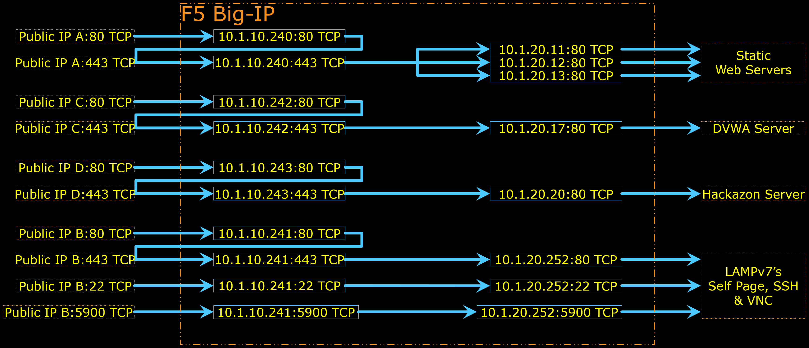

# TMSH Configuration Samples

This folder contains only **samples** of how Big-IP can be configured using TMSH Utility. Refer to [TMSH Home](https://clouddocs.f5.com/api/tmsh/) or [F5 TMSH Reference](https://clouddocs.f5.com/cli/tmsh-reference/latest/) for further details on TMSH Commands.


***

## Virtual Servers redirection from HTTP to HTTPS, SSL-OffLoad, HTTP/TCP Analytics Profile, IP Reputation, GeoLocation Filtering, DDoS Protection

The diagram below depicts the Logical Configuration Diagram built by [F5_Configurations.sh](F5_Configurations.sh) TMSH Commands. Note that not all features are "draw-able" on the diagram.


- [ ] HTTP Virtual Servers are redirected to HTTPS Virtual Server.
- [ ] HTTPS Virtual Servers are using SSL-OffLoad. Traffic to server is plain-text.
- [ ] HTTP and HTTPS Virtual Servers are attached with both HTTP and TCP Analytics Profiles.
- [ ] TCP Virtual Servers are attached with TCP Analytics Profile.
- [ ] Listener/Virtual Server on Port 22 and 5900 for SSH and VNC to the LAMPv7 Server
- [ ] Filtering out traffic coming from bad IP Reputation
- [ ] Filtering out DDoS traffic
- [ ] Filtering out all traffic except the ones coming from: Cambodia, Indonesia, Laos, Myanmar, Pakistan and Singapore

TMSH Commands configures only the stuffs inside Big-IP (refer to the diagram above).
Anything outside Big-IP shall be configured by AWS CloudFormation ; or if you use this TMSH Commands in VE or Hardware; the things outside Big-IP shall be configured separately, either manually or by other scripts or some external orchestrator node.


***

<br><br><br>
```
╔═╦═════════════════╦═╗
╠═╬═════════════════╬═╣
║ ║ End of Document ║ ║
╠═╬═════════════════╬═╣
╚═╩═════════════════╩═╝
```
<br><br><br>


