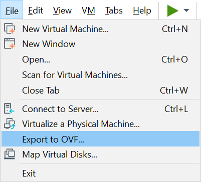

# VM Import


This section does not intent to provide full guide of importing VM into AWS, which can be referred at [Importing a VM as an image using VM Import/Export](https://docs.aws.amazon.com/vm-import/latest/userguide/vmimport-image-import.html), but only to supply additional information and/or samples not covered at the reference.


***

As per stated in the [Importing a VM as an image using VM Import/Export](https://docs.aws.amazon.com/vm-import/latest/userguide/vmimport-image-import.html) reference, importing VM image to AWS requires Open Virtualization Archive (OVA) format.

If you are using VMware WorkStation (especially version 15 or later), this can be achieved by `Export to OVF...` menu.



Then simply input proper file name and ***change*** the extension from `.ovf` to `.ova`. The system will then save the exported image in `.ova` format.


***

`trust-policy.json` file at local storage :

```
{
  "Version": "2012-10-17",
  "Statement": [
    {
      "Effect": "Allow",
      "Principal": { "Service": "vmie.amazonaws.com" },
      "Action": "sts:AssumeRole",
      "Condition": {
        "StringEquals":{
          "sts:Externalid": "vmimport"
        }
      }
    }
  ]
}
```

The `trust-policy.json` file is pretty static i.e. does not need to change from importing an image to another image, assuming you keep using the same IAM Role for the VM import/export (i.e. `vmimport` role in the example).


***

`role-policy.json` file at local storage :

```
{
  "Version":"2012-10-17",
  "Statement":[
    {
      "Effect":"Allow",
      "Action":[
        "s3:GetBucketLocation",
        "s3:GetObject",
        "s3:ListBucket" 
      ],
      "Resource":[
        "arn:aws:s3:::aws-s3-vmimport-bucket",
        "arn:aws:s3:::aws-s3-vmimport-bucket/*"
      ]
    },
    {
      "Effect":"Allow",
      "Action":[
        "s3:GetBucketLocation",
        "s3:GetObject",
        "s3:ListBucket",
        "s3:PutObject",
        "s3:GetBucketAcl"
      ],
      "Resource":[
        "arn:aws:s3:::aws-s3-vmexport-bucket",
        "arn:aws:s3:::aws-s3-vmexport-bucket/*"
      ]
    },
    {
      "Effect":"Allow",
      "Action":[
        "ec2:ModifySnapshotAttribute",
        "ec2:CopySnapshot",
        "ec2:RegisterImage",
        "ec2:Describe*"
      ],
      "Resource":"*"
    }
  ]
}
```

You need to change the AWS S3 bucket names (`aws-s3-vmimport-bucket` and `aws-s3-vmexport-bucket` on the example above), to your own import/export bucket names.

The `role-policy.json` file is pretty static i.e. does not need to change from importing an image to another image, as long as you keep using the same AWS S3 import/export buckets.


***

`containers.json` file at local storage :

```
[
  {
    "Description": "Description of the Imported VM Image",
    "Format": "ova",
    "UserBucket": {
      "S3Bucket": "aws-s3-vmimport-bucket",
      "S3Key": "ImageFileName.ova"
    }
  }
]
```

You need to change the AWS S3 bucket name, i.e. the `S3Bucket` value (`aws-s3-vmimport-bucket` on the example above), to your own import bucket name.

Replace the image file name, i.e. the `S3Key` value (`ImageFileName.ova` on the example above), with the actual image file name in the AWS S3 import bucket (after you copied the `.ova` file to AWS S3 import bucket).

Also replace the `Description` value to something representative. When there are multiple users in an AWS account, imported image can quicky lost amongst many other images (in form of SnapShots and AMIs), and `Description` field can help to differentiate one to the other images.

The `containers.json` file is pretty dynamic and needs to be modified everytime you import different VM image into AWS i.e. the `containers.json` file is specific per imported image.


***

Use [AWS Command Line Interface](https://aws.amazon.com/cli/) to issue the below commands to AWS.

Further reference on [AWS CLI version 2](https://docs.aws.amazon.com/cli/latest/userguide/install-cliv2.html) :
- [ ] [Configuration basics](https://docs.aws.amazon.com/cli/latest/userguide/cli-configure-quickstart.html)
- [ ] [Configuration and credential file settings](https://docs.aws.amazon.com/cli/latest/userguide/cli-configure-files.html)
- [ ] [Named profiles](https://docs.aws.amazon.com/cli/latest/userguide/cli-configure-profiles.html)

Depending on how you do [Configuration and credential file settings](https://docs.aws.amazon.com/cli/latest/userguide/cli-configure-files.html) of your AWS CLI, the `--profile userid` part may not be needed in your case.

`aws --profile userid iam create-role --role-name vmimport --assume-role-policy-document "file://D:\Path\to\File\trust-policy.json"`

`aws --profile userid iam put-role-policy --role-name vmimport --policy-name vmimport --policy-document "file://D:\Path\to\File\role-policy.json"`

The two commands above create an IAM Role called `vmimport` and assign role policy to it. Reference: [Required service role](https://docs.aws.amazon.com/vm-import/latest/userguide/vmie_prereqs.html#vmimport-role).

The User ID `userid` used to issue the commands MUST have permission / authorized to create the `vmimport` role.

<br><br>


Then copy the VM image `.ova` file to the AWS S3 import bucket.

`aws --profile userid s3 cp "D:\Path\to\File\ImageFileName.ova" "s3://aws-s3-vmimport-bucket/"`

<br><br>


Lastly, import the VM image `.ova` file from AWS S3 import bucket to become AWS' Amazon Machine Image (AMI) :

`aws --profile userid ec2 import-image --description "Description of the Imported VM Image" --disk-containers "file://D:\Path\to\File\containers.json"`

Example:

```
C:\>aws --profile userid ec2 import-image --description "Description of the Imported VM Image" --disk-containers "file://D:\Path\to\File\containers.json"
{
    "Description": "Description of the Imported VM Image",
    "ImportTaskId": "import-ami-0123456789abcdef0",
    "Progress": "2",
    "SnapshotDetails": [
        {
            "DiskImageSize": 0.0,
            "Format": "OVA",
            "UserBucket": {
                "S3Bucket": "aws-s3-vmimport-bucket",
                "S3Key": "ImageFileName.ova"
            }
        }
    ],
    "Status": "active",
    "StatusMessage": "pending"
}

C:\>
```

From the above example, take note of the `ImportTaskId` value i.e. `import-ami-0123456789abcdef0` on the above example.

Importing VM image into AMI takes quite some time, and to check the status of import process we will need the `ImportTaskId` value i.e. `import-ami-0123456789abcdef0` from the example above.

`aws --profile userid ec2 describe-import-image-tasks --import-task-ids import-ami-0123456789abcdef0`

Example :

```
C:\>aws --profile userid ec2 describe-import-image-tasks --import-task-ids import-ami-0123456789abcdef0
{
    "ImportImageTasks": [
        {
            "Architecture": "i386",
            "Description": "Description of the Imported VM Image",
            "ImageId": "ami-0123456789abcdef0",
            "ImportTaskId": "import-ami-0123456789abcdef0",
            "LicenseType": "BYOL",
            "Platform": "Linux",
            "SnapshotDetails": [
                {
                    "DeviceName": "/dev/sda1",
                    "DiskImageSize": 1234567890.0,
                    "Format": "VMDK",
                    "SnapshotId": "snap-0123456789abcdef0",
                    "Status": "completed",
                    "UserBucket": {
                        "S3Bucket": "aws-s3-vmimport-bucket",
                        "S3Key": "ImageFileName.ova"
                    }
                }
            ],
            "Status": "completed"
        }
    ]
}

C:\>
```

The import process is completed when BOTH `Status` fields above has value `completed`.

Take note the `ImageId` from the completed VM import process, i.e. `ami-0123456789abcdef0` from the example above, as this is the end result AMI ID you will use to launch a new instance of the imported VM image in the AWS Environment.

The import process also creates a SnapShot object. Take note at the `SnapshotId` value, i.e. `snap-0123456789abcdef0` from the example above, to look for the created SnapShot of the imported VM image.


***

<br><br><br>
```
╔═╦═════════════════╦═╗
╠═╬═════════════════╬═╣
║ ║ End of Document ║ ║
╠═╬═════════════════╬═╣
╚═╩═════════════════╩═╝
```
<br><br><br>


