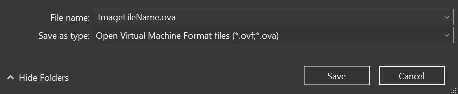

# VM Import

This section does not intent to provide full guide of importing VM into AWS, which can be referred at [Importing a VM as an image using VM Import/Export](https://docs.aws.amazon.com/vm-import/latest/userguide/vmimport-image-import.html), but only to supply additional information and/or samples not covered at the reference.

As per stated in the [Importing a VM as an image using VM Import/Export](https://docs.aws.amazon.com/vm-import/latest/userguide/vmimport-image-import.html) reference, importing VM image to AWS requires Open Virtualization Archive (OVA) format.

If you are using VMware WorkStation (especially version 15 or later), this can be achieved by `Export to OVF...` menu.


Then simply input proper file name and ***change*** the extension from `.ovf` to `.ova`. The system will then save the exported image in `.ova` format.




***

<br><br><br>
```
╔═╦═════════════════╦═╗
╠═╬═════════════════╬═╣
║ ║ End of Document ║ ║
╠═╬═════════════════╬═╣
╚═╩═════════════════╩═╝
```
<br><br><br>


