# Windows Server 2008 R2 adaptation to AWS

Below are the steps taken to adapt the **_Windows_Server_2008_v2.zip_** from **_vLab_** section under https://downloads.f5.com/   .
Note that this is just **one sample** on how to adapt the Windows Server 2008 R2 to AWS Environment.
Many other ways are available and most probably provide better results.

Some of the images in the notes are high resolution images. Just click the image to show the image in separate tab, or right-click the image and select "Open image in new tab" to have better view of the image.


### Add Management Interface

Add one additional network interface for management with IP Address : `10.1.1.251/24`


### Change Passwords

Modify system's configuration to require password to access the Windows Server; and change password of the users (may need to changed also the password of users on the Active Directory entry; i.e. for APM exercise).


### Fix the networking part which AWS messed up during VM Import process

Create a batch file to fix the networking, refer to [FixNetwork.bat](FixNetwork.bat); with content as below :

```
netsh interface ipv4 set address name="Local Area Connection 3" static 10.1.20.251 255.255.255.0 10.1.20.241
netsh interface ipv4 add address name="Local Area Connection 3" 10.1.20.32 255.255.255.0
netsh interface ipv4 add address name="Local Area Connection 3" 10.1.20.41 255.255.255.0
netsh interface ipv4 add address name="Local Area Connection 3" 10.1.20.42 255.255.255.0
netsh interface ipv4 add address name="Local Area Connection 3" 10.1.20.43 255.255.255.0
netsh interface ipv4 add address name="Local Area Connection 3" 10.1.20.44 255.255.255.0
netsh interface ipv4 add address name="Local Area Connection 3" 10.1.20.45 255.255.255.0
```

Reference :
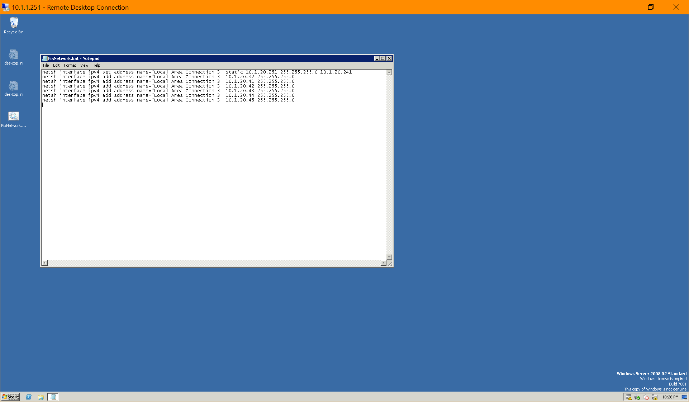

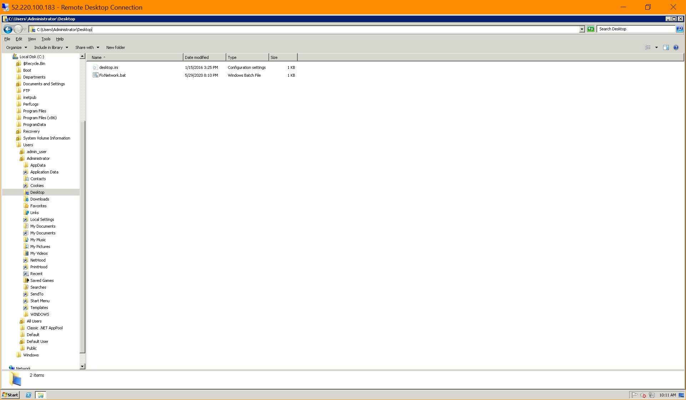

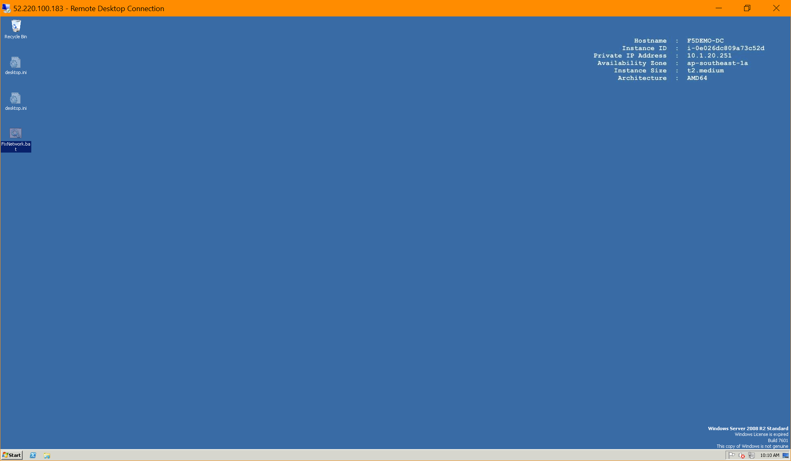


### Create Task Scheduler to execute the batch file up on start-up.

#### General

- **Name** : FixAWSNetwork
- **When running the task, use the following user account** : **F5DEMO\Administrator**
- Select : **Run whether user is logged or not**
- **Disable** : **Do not store password** &nbsp;&nbsp;&nbsp;&nbsp;&nbsp;&nbsp;&nbsp;&nbsp;&nbsp; (The Task Scheduler needs the password to run as Administrator)
- Enable : **Run with highest privileges** &nbsp;&nbsp;&nbsp;&nbsp;&nbsp;&nbsp;&nbsp;&nbsp;&nbsp; (optional)
- **Disable** : **Hidden**
- **Configure for** : **Windows 7, Windows Server 2008 R2**

Reference :
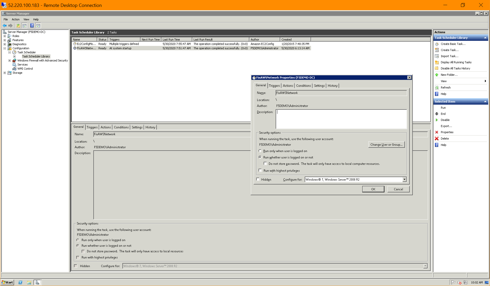


#### Triggers

- **Begin the task** : **At startup**
- Enable : **Delay task for** : 3 minutes &nbsp;&nbsp;&nbsp;&nbsp;&nbsp;&nbsp;&nbsp;&nbsp;&nbsp; (or any other value you like the delay, 1 minute should be OK)
- Enable : **Enabled**
- **Disable all other options**

Reference :
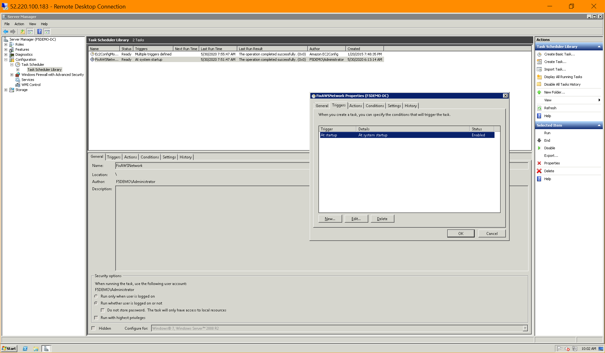

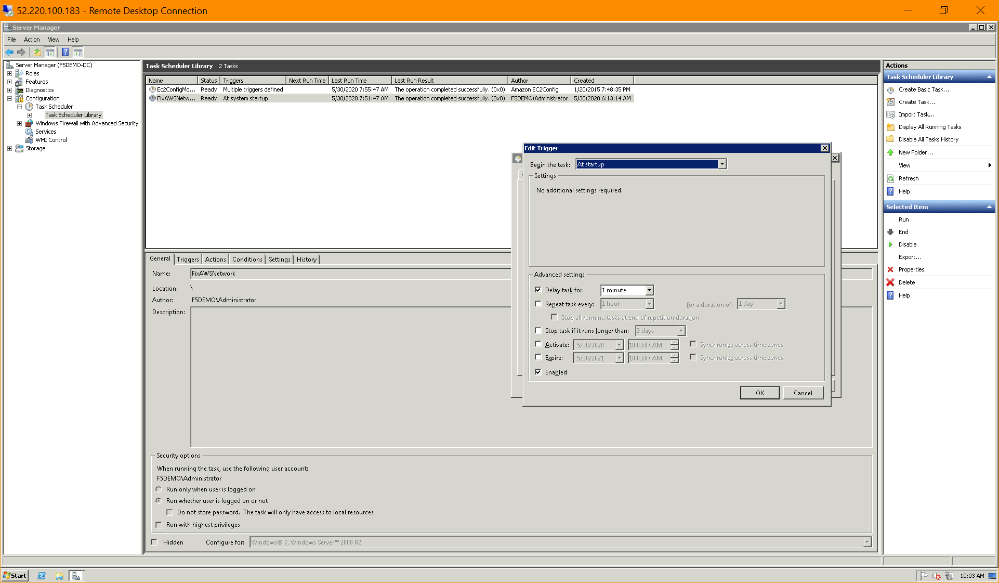


#### Actions

- **Action** : **Start a program**
- **Program/script** : **FixNetwork.bat**
- **Start in** (optional) : <strong> C:\Users\Administrator\Desktop\ </strong> &nbsp;&nbsp;&nbsp;&nbsp;&nbsp;&nbsp;&nbsp;&nbsp;&nbsp; (This field is NOT optional; input the folder where your batch file is located)
- Leave "Add arguments (optional)" field empty

Reference :
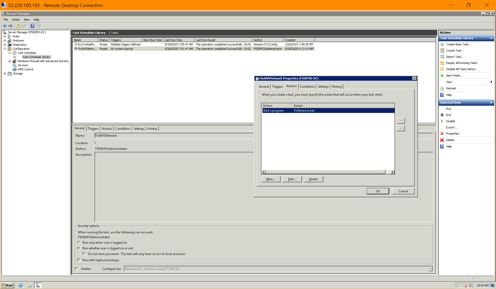

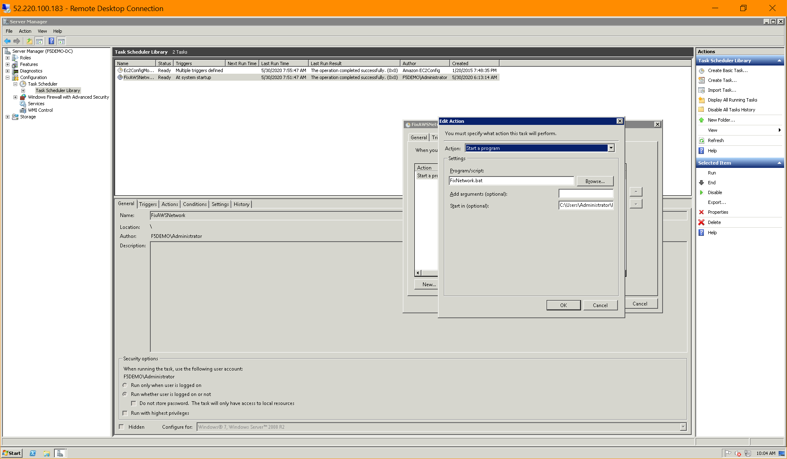

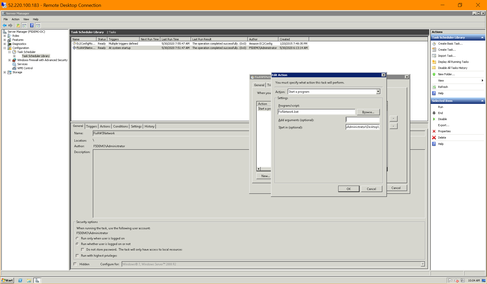


#### Conditions

- **Disable ALL fields** (including the grey ones) (enable the parent options first, disable all the child options, then disable the parent options back)

Reference :
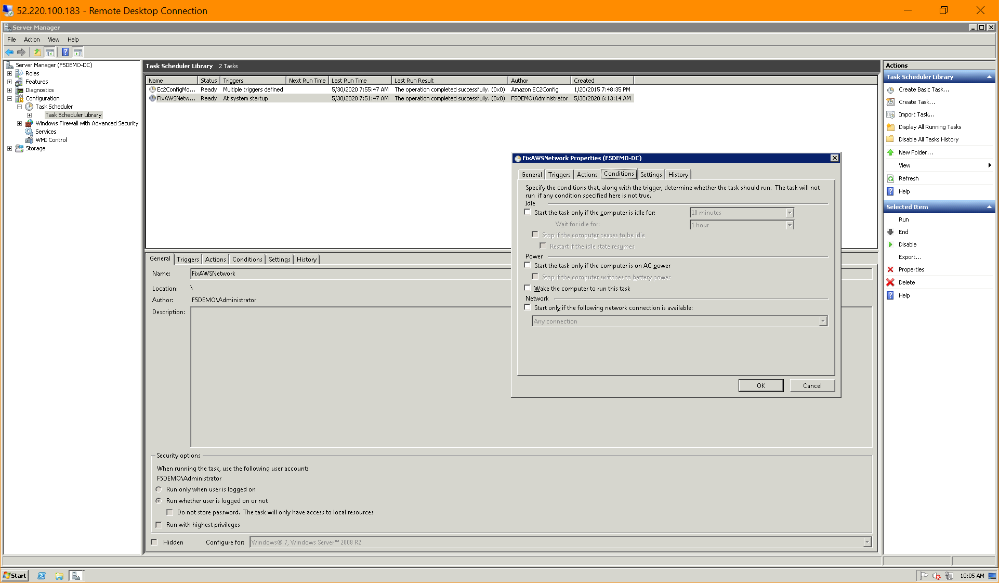


#### Settings

- Enable : **Allow task to be run on demand**
- Enable : **Run task as soon as possible after a scheduled start is missed**
- Enable : **Stop the task if it runs longer than** : 1 hour
- Enable : **If the running task does not end when requested, force it to stop**
- Select : **Do not start a new instance**
- **Disable the rest of the options**

Reference :
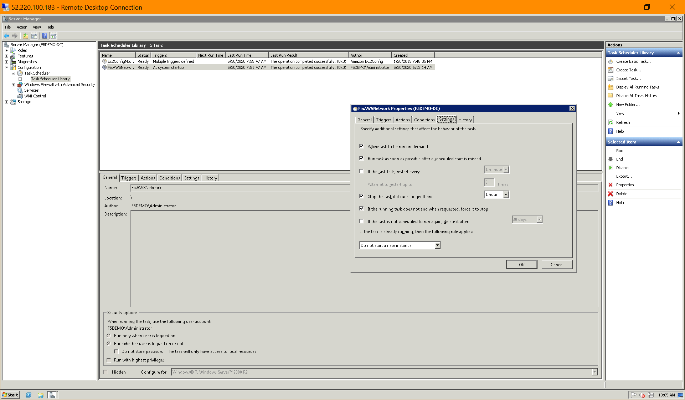


#### Other References

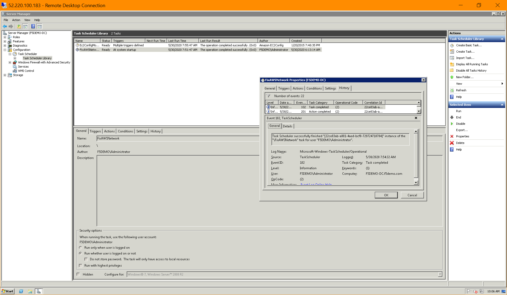

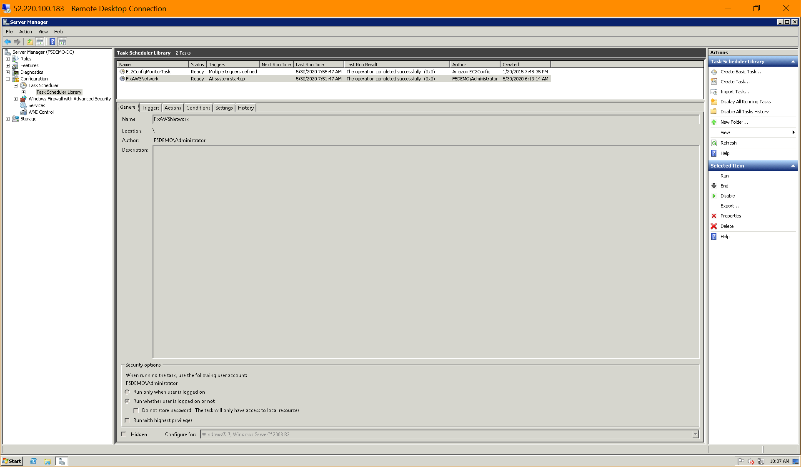

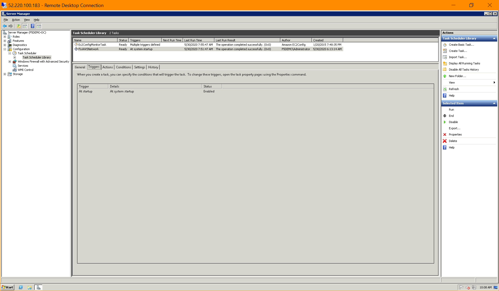


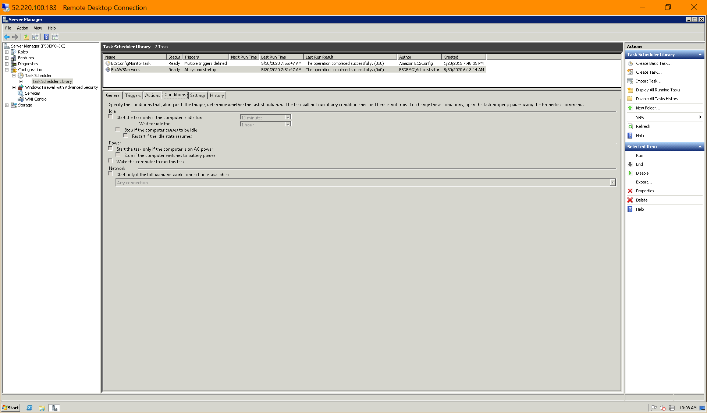

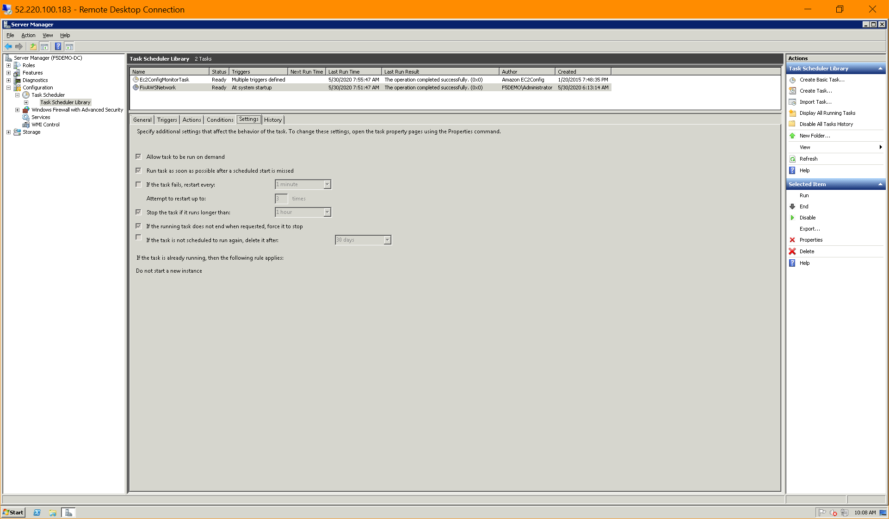

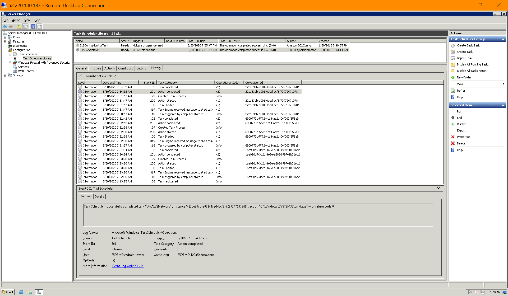


### Time Zone Setting

Change the Time Zone into : `(UTC +08:00) Kuala Lumpur, Singapore` . &nbsp;&nbsp;&nbsp;&nbsp;&nbsp;&nbsp;&nbsp;&nbsp;&nbsp; (Or any other Time Zone)

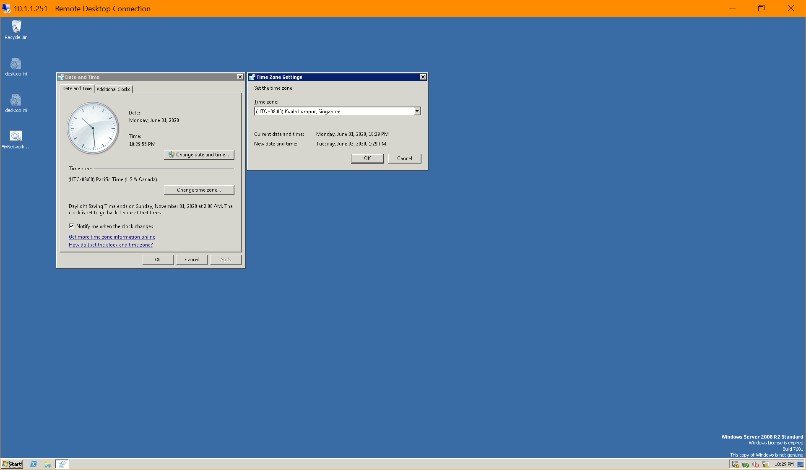


***

<br><br><br>
```
╔═╦═════════════════╦═╗
╠═╬═════════════════╬═╣
║ ║ End of Document ║ ║
╠═╬═════════════════╬═╣
╚═╩═════════════════╩═╝
```
<br><br><br>


